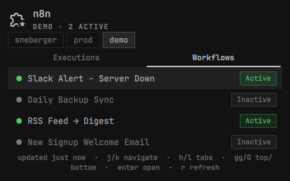

# omarchy-n8n

**n8n workflow monitoring in the Omarchy bar — no Electron, no browser tab.**

Monitor executions and toggle workflows from a native Quickshell panel.
Multi-instance support: track prod and local side by side.



## Features

- **Bar pill** — workflow icon with a live count badge. Red on failure, blue when running, quiet when all green.
- **Executions tab** — last N executions across all workflows with status, workflow name, mode, and relative time. Click → opens in browser.
- **Workflows tab** — full list with active/inactive indicator. Toggle active state inline without leaving the desktop.
- **Multi-instance** — configure prod, staging, local; switch between them inside the panel.
- **Failure notifications** — desktop alert on new failures (compares against last known state, per-instance). Click the notification to open the failed execution in your browser.
- **Vim motions** — `j`/`k` move the selection, `h`/`l` (or `[`/`]`) switch tabs, `gg`/`G` jump to top/bottom, `Enter`/`Space` opens the selected item, `r` refreshes, `Esc` closes.

## Requirements

- Omarchy Quattro shell
- `bash`, `curl`, `jq` (all stock)
- `secret-tool` (libsecret) with a running keyring service (gnome-keyring, kwallet, ...) — required for storing API keys
- An n8n instance with API enabled (n8n ≥ 0.188 for REST API; Settings → API → Enable)

## Install

```sh
omarchy plugin add https://github.com/legendik/omarchy-n8n.git --enable
omarchy bar put legendik.n8n --after omarchy.weather
```

### Uninstall

```sh
omarchy plugin remove legendik.n8n
rm -rf ~/.config/omarchy-n8n   # optional: also delete stored instances (keyring entries need: omarchy-n8n-setup remove <id> beforehand, or secret-tool clear service omarchy-n8n)
```

### First-time setup

Run the setup wizard to add your first instance:

```sh
omarchy-n8n-setup
```

You'll be prompted for:
1. Instance name (e.g. `prod`, `local`)
2. n8n URL (e.g. `http://localhost:5678` or `https://n8n.yourcompany.com`)
3. API key (n8n → Settings → n8n API → Create an API key)

If your n8n instance supports scoped API keys, the plugin only needs:
`workflow:list`, `workflow:activate`, `workflow:deactivate`, `execution:list`.
No credential, user, or write-access-to-workflow-content scopes are required.

### Multiple instances

```sh
omarchy-n8n-setup add          # add another instance
omarchy-n8n-setup list         # show all configured instances
omarchy-n8n-setup remove prod  # remove by instance id
```

## Optional hotkey

Add to your Hyprland `bindings.lua`:

```lua
o.bind("SUPER + SHIFT + N", "n8n", "omarchy-shell shell toggle legendik.n8n")
```

## Hyprland float rule

```
windowrulev2 = float, title:^(n8n)$
windowrulev2 = size 460 640, title:^(n8n)$
windowrulev2 = center, title:^(n8n)$
```

## Configuration

In the Omarchy shell settings panel:

| Key | Default | Description |
|-----|---------|-------------|
| `refreshIntervalSec` | 30 | How often to poll n8n (seconds) |
| `maxExecutions` | 20 | Max executions to fetch per instance |
| `notifyOnFailure` | true | Desktop notification on new failures |

## How it works

`omarchy-n8n-fetch` polls `GET /api/v1/workflows` and `GET /api/v1/executions` from
each configured instance, assembles a single JSON blob, and writes it to
`~/.config/omarchy-n8n/.last-state.json` (used for failure diffing).
`omarchy-n8n-toggle` calls `POST /api/v1/workflows/:id/activate` or `deactivate`.
No third party is involved at any point.

## Releasing

Releases are automated by [release-please](https://github.com/googleapis/release-please)
from [Conventional Commits](https://www.conventionalcommits.org/) on `master`
(`fix:`, `feat:`, `feat!:`/`BREAKING CHANGE:`, etc.). It opens/updates a
release PR with the version bump and changelog; merging it tags the release,
publishes it on GitHub, and updates `version` in `manifest.json`.

## License

MIT
